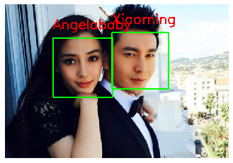

# 网易云课堂AI工程师实战项目：基于opencv进行人脸识别
## Introduction(项目介绍)

This project is one of the NetEase cloud classroom AI engineers (computer vision) practical projects. Through the comprehensive use of python and opencv, the cascade classifier CascadeClassifier is used to detect human faces, and EigenFaceRecognizer is used to build human brain models.Finally, the photos of Huang Xiaoming and Angelababy were successfully identified.

本项目为网易云课堂AI工程师（计算机视觉）实战项目之一，通过python、opencv的综合运用，使用级联分类器CascadeClassifier检测人脸，使用EigenFaceRecognizer构建人脑模型，最后成功识别黄晓明和杨颖的照片。

## Requirements(项目步骤)

1. Collecting samples
 Use CascadeClassifier CascadeClassifier to capture human brain photos of Huang Xiaoming and Yang Ying (folder faces), save the captured faces to the folder predict_faces, and clear some of the failed capture pictures.
2. Generate label
 Label each captured picture. The label value of Yang Ying is: 0, and the label value of Huang Xiaoming is: 1. The label information is stored in label.txt.
3. Training model
 Use EigenFaceRecognizer to perform model training on Huang Xiaoming and Yang Ying's captured photos to generate Huang Xiaoming and Yang Ying's face models. Save the model file as predictfaceXiaoMing_AB.xml.
4. Face recognition
 Test the face models of Huang Xiaoming and Yang Ying (predictfaceXiaoMing_AB.xml), the test folder is named test, and all 4 photos are tested correctly.

----------

			
1. 采集样本
 使用级联分类器CascadeClassifier对黄晓明和杨颖的照片（文件夹faces）进行人脑捕捉，对捕捉的人脸保存到文件夹predict_faces下，并对部分捕捉失败的图片进行清除。
2. 生成label
 对每一张捕捉的图片进行标签，杨颖的标签值为：0，黄晓明的标签值为：1，标签信息储存到label.txt。
3. 训练模型
 使用EigenFaceRecognizer对黄晓明和杨颖的捕捉照片进行模型训练，生成黄晓明和杨颖的人脸模型，保存模型文件为predict_face_XiaoMing_AB.xml。
4. 人脸识别
 测试黄晓明和杨颖的人脸模型（predict_face_XiaoMing_AB.xml)，测试文件夹名为test，4张照片全部测试正确。

## IDE(项目环境)

- Jupyter Notebook6.0.1
- python3.7.4
- opencv4.2.0
- opencv-contrib-python

## Display(项目展示)

## Resources(项目资源)

- [AI engineer of Netease cloud classroom (computer vision)](https://mooc.study.163.com/smartSpec/detail/1001457001.htm)
- [网易云课堂AI工程师（计算机视觉）](https://mooc.study.163.com/smartSpec/detail/1001457001.htm)

## Thanks(鸣谢)

- [Netease cloud classroom ](https://mooc.study.163.com/)
- [网易云课堂](https://mooc.study.163.com/)