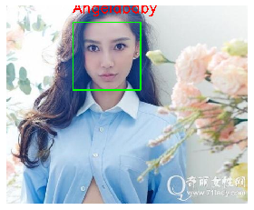

# 【阿里云Apsara Clouder认证】Python数据科学分析实战_足球运动员特征分析

## Introduction(项目介绍)

This project is one of the practical projects of Python data scientific analysis of Alibaba Cloud Apsara clouder skill certification. Through the comprehensive application of pandas, numpy and Matplotlib, the data samples of football players are comprehensively analyzed. Through the practical training of this project, the common database of Python data science is achieved and further mastered.

本项目为阿里云Apsara Clouder技能认证Python数据科学分析实战项目之一，通过pandas、numpy及matplotlib的综合运用，对足球运动员的数据样本进行综合分析。通过该项目的实战训练，达到对python数据科学的常用库及进一步掌握。

## Requirements(项目要求)

1. View basic data information: missing value, abnormal value, duplicate value, etc
2. Check the height, weight and scoring information distribution of athletes
3. Check the number deviation between left foot and right foot players
4. Considering the average score of players, clubs / countries with TOP10 scoring ability
5. Which clubs have more loyal players (5 years and above)
6. Is the football player related to the month of birth
7. Whether the number of football players is related to the position
8. Is there any correlation between height and weight
9. Which indicators have a greater impact on the score
10. Suppose we don't know the specific meaning of the last two columns, analyze the possible meaning of the title
11. What is the relationship between age and score

----------

			
1. 查看数据基本信息：缺失值、异常值、重复值等
2. 查看运动员的身高，体重，评分信息分布
3. 查看左脚与右脚选手在数量上的偏差
4. 从球员平均评分上考虑，拥有top10评分能力的俱乐部/国家
5. 哪些俱乐部拥有更多忠心的球员（5年及以上）
6. 足球运动员是否与出生月份相关
7. 足球运动员的号码是否与位置相关
8. 身高与体重是否具有相关性
9. 哪些指标对评分的影响较大
10. 假设我们不清楚后两列的具体含义是什么，分析该标题可能的含义
11. 年龄与评分具有怎样的关系

## IDE(项目环境)
- [阿里云大学开放实验室](https://edu.aliyun.com/lab/?spm=5176.11105641.1149155.5.i6CdTI)

- Jupyter Notebook6.0.1

- python3.7.4

## Display(项目展示)

## Certification(认证证书)

## Resources(项目资源)

- [Apsara Clouder AI special skill certification: Python data science analysis practice](https://edu.aliyun.com/certification/clda02?spm=5176.11999222.1216634.65.582f5e9bgwE0BL)
- [Apsara Clouder人工智能专项技能认证：Python数据科学分析实战](https://edu.aliyun.com/certification/clda02?spm=5176.11999222.1216634.65.582f5e9bgwE0BL)

## Thanks(鸣谢)

- [Alicloud University ](https://edu.aliyun.com/?spm=5176.12034176.1149155.1.17d947bat8DdNy)
- [阿里云大学](https://edu.aliyun.com/?spm=5176.12034176.1149155.1.17d947bat8DdNy)